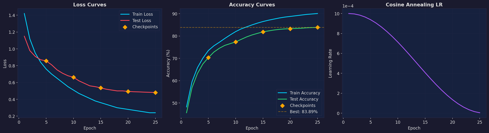
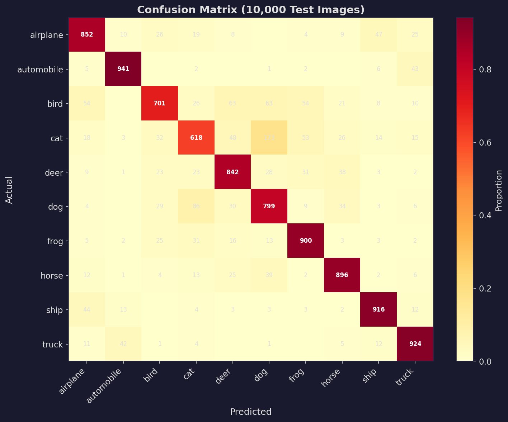
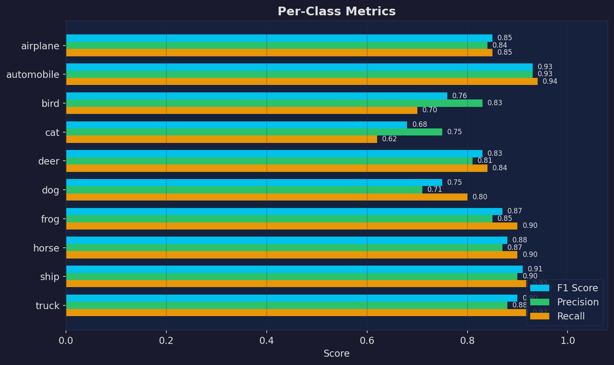
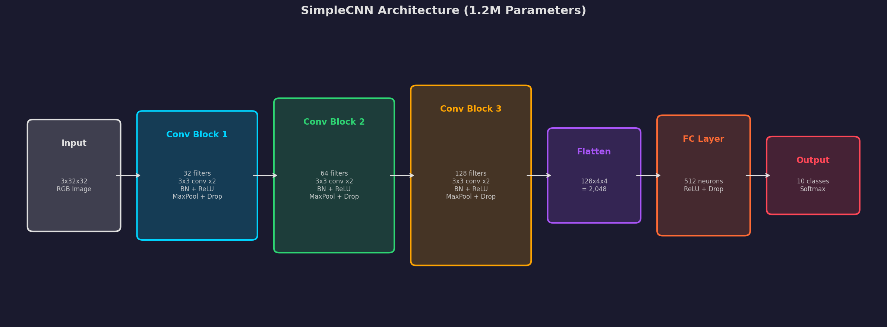

# CV Image Classifier

A convolutional neural network (CNN) image classifier built with PyTorch. Trains on CIFAR-10 (60K images, 10 classes) and achieves 83.89% test accuracy. Includes a Gradio web UI for interactive predictions.

## Results

### Training Performance


The model trains for 25 epochs with cosine annealing learning rate decay. Train accuracy reaches 90.1% while test accuracy plateaus at 83.89% — the ~6% gap indicates mild overfitting, which is typical for small models on CIFAR-10. The LR drops smoothly from 1e-3 to near-zero, helping the model settle into a good minimum.

| Metric | Value |
|--------|-------|
| Test Accuracy | **83.89%** |
| Parameters | ~1.2M |
| Training Time | ~2 min (RTX 4090) |
| Epochs | 25 (no early stopping triggered) |
| Optimizer | Adam + Cosine Annealing |
| Dataset | CIFAR-10 (50K train / 10K test) |

### Confusion Matrix


Out of 10,000 test images:
- **Best classes**: automobile (94.1%), truck (92.4%), ship (91.6%) — vehicles with distinct shapes
- **Worst classes**: cat (61.8%), bird (70.1%), dog (79.9%) — animals with variable poses/textures
- The biggest confusion: **173 cats misclassified as dogs** (they share fur, ears, similar shapes)

### Per-Class Metrics


The model handles vehicles (automobile, ship, truck) much better than animals (cat, bird, dog). This makes sense — vehicles have rigid, consistent shapes while animals vary widely in pose, color, and background.

### Architecture


## How It Works

```
Input Image (32x32 RGB)
     |
[Conv Block 1] --> 32 filters, 3x3 conv x2, BatchNorm, ReLU, MaxPool --> 16x16
     |
[Conv Block 2] --> 64 filters, 3x3 conv x2, BatchNorm, ReLU, MaxPool --> 8x8
     |
[Conv Block 3] --> 128 filters, 3x3 conv x2, BatchNorm, ReLU, MaxPool --> 4x4
     |
[Flatten] --> 128 * 4 * 4 = 2,048 features
     |
[FC Layer] --> 512 neurons, ReLU, Dropout(0.5)
     |
[Output] --> 10 class probabilities (softmax)
```

**What does each part do?**
- **Conv layers** slide small filters across the image to detect patterns (edges, textures, shapes)
- **BatchNorm** normalizes activations so training is faster and more stable
- **MaxPool** shrinks the feature maps by 2x, making the model focus on "what" not "where"
- **Dropout** randomly zeroes neurons during training to prevent overfitting
- **Fully connected layers** combine all detected features into a final classification

## Features

- **SimpleCNN** architecture with 3 convolutional blocks (~1.2M parameters)
- **CIFAR-10** dataset support (10 classes: airplane, automobile, bird, cat, deer, dog, frog, horse, ship, truck)
- **Data augmentation** (random crop, flip, color jitter) to prevent overfitting
- **Cosine annealing** learning rate schedule with early stopping
- **Interactive web UI** powered by Gradio — upload any image and get predictions
- **GPU accelerated** training with CUDA (tested on RTX 4090)

## Setup

```bash
git clone git@github.com:H4ph4z4rdz/cv-image-classifier.git
cd cv-image-classifier

python -m venv venv
venv\Scripts\activate          # Windows
# source venv/bin/activate     # Linux/Mac

pip install torch torchvision --index-url https://download.pytorch.org/whl/cu124
pip install -r requirements.txt
```

## Usage

### 1. Train the Model

```bash
python src/train.py
```

### 2. Launch the Web UI

```bash
python src/app.py
```

Open **http://localhost:7860** in your browser.

### 3. Evaluate on Test Set

```bash
python src/evaluate.py --model models/saved/best_model.pth
```

### 4. CLI Prediction

```bash
python src/predict.py --image path/to/image.jpg --model models/saved/best_model.pth
```

## Project Structure

```
cv-image-classifier/
├── assets/                    # Charts for README
├── configs/
│   └── default.yaml           # All configuration
├── data/
│   └── raw/                   # Downloaded dataset (auto-fetched)
├── models/
│   ├── saved/                 # Best trained model
│   └── checkpoints/           # Periodic checkpoints
├── results/
│   ├── plots/                 # Generated evaluation charts
│   └── logs/                  # Training logs
└── src/
    ├── train.py               # Training script
    ├── evaluate.py            # Evaluation with detailed metrics
    ├── predict.py             # CLI single-image inference
    ├── app.py                 # Gradio web UI
    ├── generate_charts.py     # Chart generation for README
    ├── data/
    │   └── dataset.py         # Data loading & transforms
    ├── models/
    │   └── cnn.py             # CNN architecture
    └── utils/
        └── helpers.py         # Seed, device, checkpoint utilities
```

## Configuration

Edit `configs/default.yaml`:

| Parameter | Default | Description |
|-----------|---------|-------------|
| `data.batch_size` | 64 | Images per training step |
| `training.epochs` | 25 | Training iterations over full dataset |
| `training.learning_rate` | 0.001 | Step size for weight updates |
| `data.augmentation` | true | Enable data augmentation |
| `training.early_stopping_patience` | 5 | Stop if no improvement for N epochs |

## Tech Stack

- **PyTorch** — Deep learning framework
- **torchvision** — Datasets, transforms, pretrained models
- **Gradio** — Interactive web UI for predictions
- **Matplotlib / Seaborn** — Visualization
- **scikit-learn** — Evaluation metrics

## License

MIT
